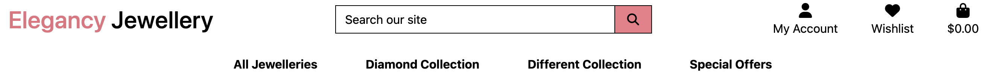
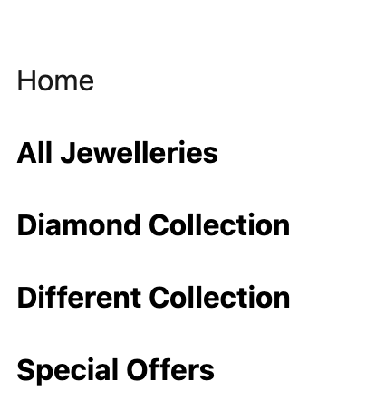

Elegancy jewellery is my fifth and final project, part of the Code Institute, Full Stack Web Developer Course.
The purpose of this project was a build a full-stack site based around a business logic used to control a centrally-owned dataset. The technologies used for this project are HTML, CSS, JavaScript, Python, and Django. Stripe handles online test payments and Heroku Postgres as a relational database.

# Table of Contents
## [Jewellery Shop Introduction](#jewllery-shop---introduction)
## [Ux](#ux)
   * [User Stories](#user-stories)
   * [Agile Methodologies](#agile-methodologies)
   * [Database Diagram](#deployment)
   * [Surface](#surface)
   * [Structure](colors, images, fonts WhishList, UserProfile, Order..)
   * [Skeleton](Wireframes, Shopping Bag Wireframes, All Products Wireframes, Account page, Checkout Page ....)
   

## [Testing](#testing)
  * Link to Testing.md 

## Technologies Used
 * Languages Used
 * Frameworks/Libraries 
 
 ## Deployment
 * Creating a Clone 
 * Forking this repository
 * Heroku Deployment
 * AWS S3 Bucket setup
 * AWS IAM(Identity and Access Managenent) setup ) 
 * Connecting Heroku to AWS S3
 
 ## Credits
  * Product images
  * Code
  * Bootstarp
  * Django Documentation

## Aknowledgements
  * Linkedin
  * GitHub
  * youtube
  
# Jewllery Shop - Introduction 
The Jewelry Shop is  an E-commerce shop where users can find and buy jewellery also search for jewelleries by filtering different categories. They can also register by filling in their personal information on the website’s profile page. The application has a good appearance with an easy, clear and concise site navigation. web application built using Python, JavaScript, and Django, designed to provide a seamless and user-friendly platform for buying and selling exquisite jewelery pieces. Whether you are a jewelery enthusiast, a buyer looking for the perfect gift, or an artisan seeking to showcase your creations, this platform caters to all.

(Add live project here)
(Add image of project from I am response)

# UX 
User stories help us understand the needs and expectations of our users. They serve as a basis for defining features and guide our development process. Below are some user stories that represent the different roles and interactions within the Jewelry Project:

## User Stories

 As a Buyer, I want to:
  * Provide buyers with an extensive range of jewelry options.
  * Categorize jewelry for easy navigation, such as necklaces, rings, and bracelets, by type of material: gold, silver etc.
  * Implement filters to refine search results by material, style, price, and more.
  * Easily access a "New Arrivals" section on the home page to stay updated with the latest additions.
  * Display high-quality images of each product.
  * Include product descriptions, product categories, materials, rates and prices.
  * Allow buyers to click on each product to view all details.
  * Ensure a user-friendly and responsive website or app design.
  * Enable easy account creation and login.
  * Provide a streamlined shopping cart and checkout process. 
  * As a logged-in user, I want to be able to add products to my wishlist, so that I can view those products later.
  * As a logged-in user, I was to be able to remove products from my wishlist, so that my wishlist is only full of products I want to be saved.
  * Allow buyers to access a profile page where they can submit a form to order custom-made jewellery.  
  * To see a history of all submitted custom-made orders.
  * Enable buyers to easily access and review their order history. 
  * As a buyer, I want to provide secure payment options for customers, such as integrating with secure payment gateways (e.g. Stripe)
         
 As the Register User I want to :

  * As a user, I can use the website on all device sizes so that I can see the same information on small and large devices.
  * As a user, I can use the navigation bar so that I can view all pages of the website easily
  * As a site user, I want to be able to sign up, so that I can have a personal account on the site.
  * As a site user, I want to be able to receive an email confirmation after registering, so that I can verify that my account registration was successful.
  * As User I want to been able to add and remove products from my cart
  * As User I want to recieve feedback that my order was processed successfully.
  * As User I want to subscribe to the store newsletters.

 As the Unregistered User I want to:

  * As Unregistered User I want to see the purpose of the site when landing on it
     * Landing page with clear reference to objective of the app
  * As an Unregistered User I want to get a benefit if I register*
    * Information recieved in the registration mail
  * As an Unregistered User, I want to be able to register so that I   can create my account and access to the registered user features
    *  Link for Sign Up in Navbar
  * As an Unregistered User I want to see the detailed information of the wares
    * Ware's details page

  ## Agile Methodologies
  
  The Agile Methodology approach was adopted during the development of the Elegancy Jewellery - store. I have utilized GitHub's built-in features such as issue tracking and project management to effectively manage tasks and monitor progress. 
1. Epic - Project Setup

  * Install Django framework that provides tools and libraries for building web application.
  * Install Django Allauth, it allaows us to manage user authentication, registration,and account management seamlessly.
  * Crispy Forms this Django package that will help us style our forms easily and effficiently.
  * Create jewelry_shop app.
  * Create superuser
2. Epic - Homepage and Navigation Setup 
  * Navigation bar. Will provide easy access to different sections of application, easy to navigate on mobile screens.
  * Implement categories links in the navigation bar for organized content access, also include a home button to quickly return to the home page. 
  * Enhance the aesthetic appeal of the homepage with background image. 
  * Implement a search bar to enable to search for products or content.
  * Create cart functionality for user to add items they want to purchase.
  * Populate the homepage with fixture data to showcase new arrivals.
  * Implement user authentication with login and logout buttons.
  * Create footer section with the links and newsletter subcription form.
3.   Implementing Login and Logout 
  * Create login, registration and logout pages.
  * Create forms for user login, registration and logout, ensuring data validation and security. 
  * Implement email configuration for the user accounts to verify the authenticity of email addresses during registration.
4. Creating a Product App
  * Create Product app
  * Design and create templates for displaying products,products_details.
  * Populate your database with fixture data conatining product information, including images and categories.
  * Implement functionality to cotegorize products and allow users to filter products by categories. Implement a search bar that enables users to search for specific products based on keywords. Also implement sorting options(by price, name, and letters..)
  * Add pagination to the product listings to ensure that large catalogues can be easily navigated.
5. Creating a Cart App
  * Create a Cart App, and add models, views and templates. 
  * Implement cart functionality to add, update and remove items from the cart.
  * Calculate the total cost of items in the cart, including discounts.
  * Develop checkout process,including user authentication,address input and payment process.
  * Create templates and view to display order confirmation details after a successful purchase.
6. Creating a Profile App
  * Implement functionality to allow users to view and update their personal information and preferences.
  * Integrate user authentication to ensure that users can access and manage their profile.
    Extend the profile app to include a section where users can view their order history.
  * Create a custom form whithin the profile app that allows users to order custom jewellery, either for themself or friends also can view their custom jewellery order.
7. Creating Custom Order app
  * Users can access a user-friendly order form where they can specify their custom jewelry requirements.
  * The form includes fields for selecting materials, gemstones, a description of the design, and type of jewellery: ring necklace, earrings.
8. Checkout App
  * Click the button "Secure Checkout" button similar call-to-action on the cart page.
  * Provide the shipping address where you want users to order to be delivered.
  * Users may have the option to save address for future orders.
  * Enter payment details, which typically include credit/debit card information or order payment methods.
  * Users can carefully review the order summary, including, the items, shipping address and total cost.
9. Contact Us App 
  * Users can easily reach out to customer support for assistance with product inquiries, order issues, returns, or any other concerns.
  * Contact Us include a user-friendly contact form that user can fill out.
  * Fields in the form should typically include: the name, email address, message, and contact information. 
10. Stripe payment 
      *  
  ## Database Diagram    
      [Link Data Shema](https://drawsql.app/teams/aliona/diagrams/jewellery-shop)
      
  1. User:
    * Relationships:
        * Users can have a UserProfile (one-to-one).
        * Users can place Orders (one-to-many).
        * Users can create ProductReviews (one-to-many).
        * Users can make CustomJewelleryDesign requests (one-to-many).
        * Users can use the "Contact Us" feature (one-to-many).
  2. UserProfile:
    * Relationships:
        * UserProfile is associated with a User (one-to-one).
  3. Order:
    * Relationships:
       * Orders are placed by Users (many-to-one).
       * Orders consist of OrderLineItems (one-to-many).
  
  4. OrderLineItem:
    * Relationships:
       * OrderLineItems belong to Orders (many-to-one).
       * OrderLineItems refer to Products (many-to-one).
  5. ProductReview:
    * Relationships:
       * ProductReviews are written by Users (many-to-one).
       * ProductReviews are about Products (many-to-one).
  6. Product(Jewellery):
    * Relationships:
       * Products belong to Categories (many-to-one).
       * Products can have ProductReviews (one-to-many).
       * Products can be included in OrderLineItems (many-to-many through Orders).
  7. CustomJewelleryDesign:
    * Relationships:
       * CustomJewelleryDesign requests are made by Users (many-to-one).
  8. ContactUs:
    * Relationships:
       * "Contact Us" messages can be sent by Users (many-to-one).
  9. Category:
    * Relationships:
       * Products belong to Categories (many-to-one).

  ## Surface
    * Home Page Features Description 

  1. Logo
   * Logo: The home page prominently displays shop logo at the top, by clicking on the logo users will be able to return to homepage.

  2. Navigation Bar 
   * Navigation Bar with Categories:A navigation bar provides easy access to various product categories, making it simple for users to browse and find the products they're interested in.
    
   * Mobile navigation(Burger Menu): on mobile screens,a convenient burger menu icon is provided, which, when tapped, opens a dropdown menu with navigation options.  This ensure a responsive and user-friendly experience on smaller devices.
   * Clicking the "Home" button in the navigation bar takes users back to the homepage from any pages on the website, ensuring smooth navigation.

  3. Profile   
   * User can create and personalize their profiles,and their profile logo are displayed in the right side of screen.
   * The login and logout buttons are conveniently located in the header, allowing users to securely access their accounts or log out when needed.
    

  4. Shop Now Button 
   * A prominent "Shop Now" button is strategically placed to encourage users to start shopping immediately upon viting the site.

  5. Features   
   * The home page features a dedicated section showcasing the latest arrivals. Users can quickly see and explore the newest products store has to offer.

  6. Footer   
   * At the button of the page, a comprehensive footer contains various links, such as Facebook, LinkedIn, Twitter, GitHub, Google, and Instagram.
    
   * Users can subscribe to newsletter directly from the footer . This allows you to build a mailing list and keep customers informed about promotions,updates, and news related to your brand.

  7. Search 
   * A prominent search bar is located in the navigation bar, allowing users to quickly search for specific products or content on your website. This feature ennhance the user's ability to find what they need efficiently. 

  * Product Page Features

  1. 
   * Main Jewellery page offer products on large resolutions in a row of three. Images are large to attract the user's attention, and clicking the image will redirect the user to the product detail page. 
   * The product title and description provide essential information about the product.
  2.
   * Detailed specifications and additional information about the product are provided.
   * Users can learn about materials, dimensions, care instructions, and more.
   * Users can easily add the product to their shopping cart for future purchase.
  2.
   * The "Sort By" tool is a powerful feature that empowers users to customize how they view and interact with our extensive collection of jewelry products. It provides flexibility and control over the product listing, allowing users to tailor their browsing experience according to their needs and preferences.
  3.
   * Pagination is a user interface feature that enhances the browsing experience for users when navigating through extensive lists of jewelry products. It ensures that the product listings remain organized and manageable, enabling users to explore our diverse collection with ease.
  4. 

  * Cart/ Shopping Bag 

  1. 
   * Almost all actions provide feedback to the user via the bootstrap toasts written to provide user feedback.
   * Users shopping can view the current items within the bag and total cost. The discount is visible and the user is told how much they need to spend to get discount.
  2.  
   * The shopping bag page is fully responsive, showing users a picture of the item, name, price per unit, and total price.
   * Users can also choose to increase/decrease the number of items in their bag, click the update button to have the prices update.
   * User can click the remove link and have all the items within the bag removed, regardless of quantity.
   * At the bottom of the page user can find the cost of the bag, cost of delivery, the total and how much they must spend to be eligible for free delivery.
  3. 
    * Users who checkout will see a simple overlay with a spinning icon while the payment is processed.

  * Jewellery Custom Form
  1. 
    * 
  2. 

  * Contact Us Page
  1. 
     * 
     
  * Profile   
  1. 
     * User can see history of his orders see custom order forms....

## Structure
  1. Colors
  
  2. Images
  3. Font
## Testing
[Link to TESTING.md](https://github.com/Aliona83/project_j/blob/main/TESTING.md)

## Technologies Used
 
* Languages
  * Javascript
  * Python
  * HTML
  * CSS

* Frameworks - Libraries - Programs Used

   * Django: Main python framework used in the development of this project
   * Django-allauth: Authentication library used to create user accounts
   * Heroku - Used as the cloud-based platform to deploy the site.
   * GitHub - Used for version control and agile methodology.
   * PostgreSQL Used as the database for this project.
   * W3C - Used for HTML & CSS Validation.
   * Font Awesome - Used for icons on the home page and stars on the About page.
   * Font Awesome - Used for icons on the home page and stars on the About page.
   * Jshint - Used to validate the JavaScript page.
   * Crispy Forms Used to manage Django Forms.
   * Bootstrap: CSS used for developing responsiveness and styling the website.

  ## Deployment
   [Link to DEPLOYMENT.md](https://github.com/Aliona83/project_j/blob/main/DEPLOYMENT.md)
   ## Credit 

